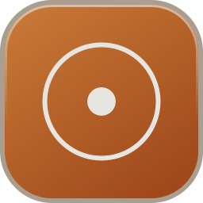
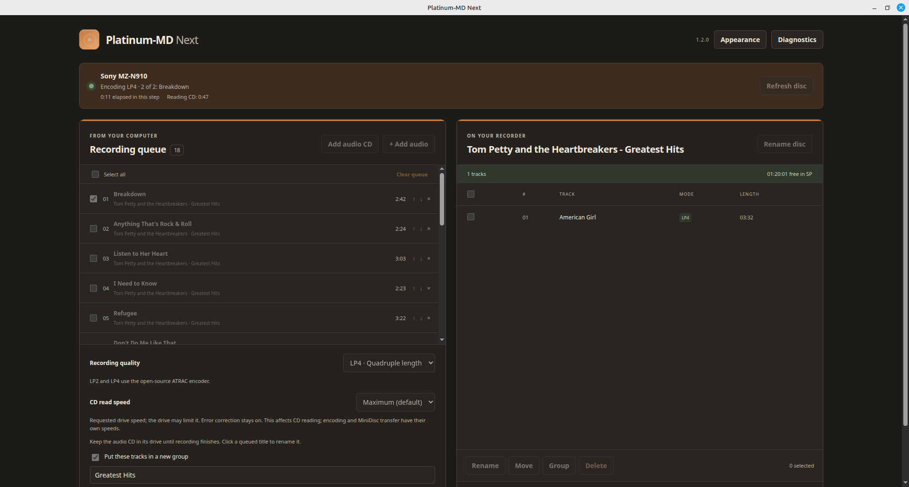

**⚠️ Note that this software is 100% vibe-coded, first with ChatGPT and now with Claude ⚠️**

<p align="center"></p>

# Platinum-MD Next

Record music to NetMD MiniDisc recorders from Linux. A modernized fork of [Platinum-MD by Gavin Benda](https://github.com/gavinbenda/platinum-md).



## Features

- Record audio files (FLAC, MP3, WAV, AAC and more) or audio CDs in SP, LP2 or LP4
- Drag and drop files into the recording queue; reorder and rename before recording
- Look up CD album and track names on MusicBrainz, and name an empty disc after the album
- Rename, move and delete tracks on the MiniDisc, organise them in groups, and control playback on the recorder
- Eight colour themes (more can be added), each with light and dark modes

## Install

<!-- download-start -->

[Download the .deb installer](https://github.com/kirjolohi69/platinum-md-next/releases/latest).

<!-- download-end -->

Double-click the `.deb` to install it, or run `sudo apt install ./Platinum-MD-Next-*-linux-amd64.deb`. Open **Platinum-MD Next** from the application menu and connect your recorder. If it was already plugged in, unplug and reconnect it once.

**Requirements:** Linux Mint 22 or Ubuntu 24.04, 64-bit Intel/AMD. See the [installation guide](docs/INSTALL.md) for upgrading and removal.

Tested with a Sony MZ-N910 on Linux Mint 22.3. Other NetMD recorders are untested; reports are welcome in [Issues](https://github.com/kirjolohi69/platinum-md-next/issues). Use **Diagnostics → Save report** when reporting a problem, and check the report for private file names first.

## Good to know

- After recording, keep the recorder powered while it saves the disc's track list. If the lid of an MZ-N910 (or similar recorder's lid) stays locked, press its **STOP** button and wait for "TOC Edit" to disappear.
- Groups are supported: they are shown in the track list and kept up to date when you delete or move tracks or rename the disc. Select tracks and click **Group** to make a new group, or tick **Put these tracks in a new group** when recording an album.
- Track titles are limited to basic Latin characters; accents are simplified.
- Not supported: Hi-MD (maybe in the future), copying audio from a MiniDisc back to the computer, Windows and macOS.
- Album lookup is optional. It sends only the CD's track timings to MusicBrainz, never your audio. See [CD metadata](docs/CD_METADATA.md).

## Build from source

On Ubuntu 22.04 (the oldest supported system, so the result runs everywhere) with Node.js 24:

```bash
sudo apt-get install -y build-essential cmake pkg-config git python3 libusb-1.0-0-dev libgcrypt20-dev libjson-c-dev
npm ci
npm test
npm run native        # build the bundled NetMD, audio and CD helpers
npm run package:linux # writes the .deb and .rpm to release/ (the .rpm needs the `rpm` package)
```

`npm run dev` starts the app after `npm run native`. The app is in `app/` (Electron main process) and `ui/` (Vue interface). Release steps are in [docs/PUBLISHING.md](docs/PUBLISHING.md) and changes in the [changelog](docs/CHANGELOG.md).

## License and credits

MIT, see [LICENSE](LICENSE). Based on Platinum-MD by Gavin Benda. Bundled tools (linux-minidisc, atracdenc, FFmpeg, cdparanoia) keep their own licenses, listed in [THIRD_PARTY_NOTICES.md](THIRD_PARTY_NOTICES.md). This is an independent community project, not affiliated with Sony or the original author.
